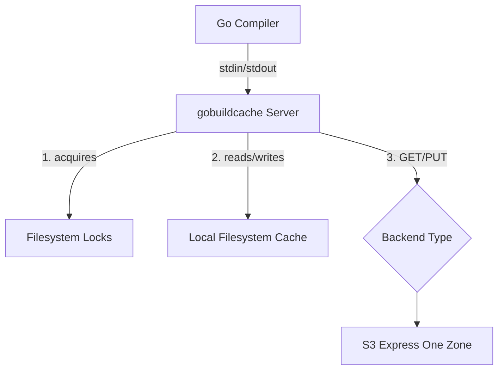
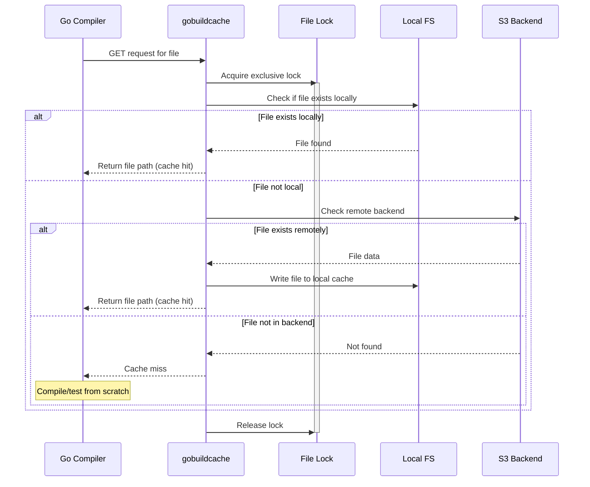
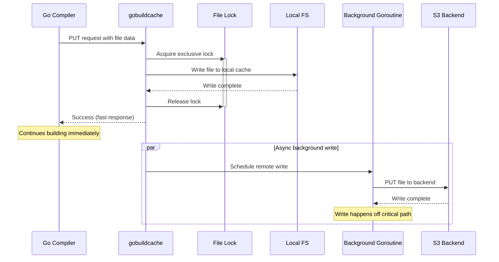

- [Overview](#overview)
- [Quick Start](#quick-start)
  - [Installation](#installation)
  - [Usage](#usage)
  - [Github Actions Example](#github-actions-example)
  - [S3 Lifecycle Policy](#s3-lifecycle-policy)
- [Preventing Cache Bloat](#preventing-cache-bloat)
- [Configuration](#configuration)
- [Lifecycle-Aware Features](#lifecycle-aware-features)
  - [Touch-on-GET](#touch-on-get)
  - [Debounced Touch](#debounced-touch)
  - [Conditional PUT](#conditional-put)
  - [Lifecycle-Aware Metrics](#lifecycle-aware-metrics)
- [Read-Only Mode](#read-only-mode)
- [Local Testing with MinIO](#local-testing-with-minio)
- [How it Works](#how-it-works)
  - [Architecture Overview](#architecture-overview)
  - [Processing GET commands](#processing-get-commands)
  - [Processing PUT commands](#processing-put-commands)
  - [Locking](#locking)
- [Frequently Asked Questions](#frequently-asked-questions)
  - [Why should I use gobuildcache?](#why-should-i-use-gobuildcache)
  - [Can I use regular S3?](#can-i-use-regular-s3)
  - [Do I have to use gobuildcache with self-hosted runners in AWS and S3OZ?](#do-i-have-to-use-gobuildcache-with-self-hosted-runners-in-aws-and-s3oz)

# Overview
`gobuildcache` implements the [gocacheprog](https://pkg.go.dev/cmd/go/internal/cacheprog) interface defined by the Go compiler over a variety of storage backends, the most important of which is S3 Express One Zone (henceforth referred to as S3OZ). Its primary purpose is to accelerate CI (both compilation and tests) for large Go repositories. You can think of it as a self-hostable and OSS version of [Depot's remote cache feature](https://depot.dev/blog/go-remote-cache).

Effectively, `gobuildcache` leverages S3OZ as a distributed build cache for concurrent `go build` or `go test` processes regardless of whether they're running on a single machine or distributed across a fleet of CI VMs. This dramatically improves CI performance for large Go repositories because each CI process will behave as if running with an almost completely pre-populated build cache, even if the CI process was started on a completely ephemeral VM that has never compiled code or executed tests for the repository before.

`gobuildcache` is highly sensitive to the latency of the remote storage backend, so it works best when running on self-hosted runners in AWS targeting an S3 Express One Zone bucket in the same region as the self-hosted runners. That said, it doesn't have to be used that way. For example, if you're using Github's hosted runners or self-hosted runners outside of AWS, you can use a different storage solution like Tigris. See `examples/github_actions_tigris.yml` for an example of using `gobuildcache` with Tigris.

# Quick Start

## Installation

```bash
go install github.com/richardartoul/gobuildcache@latest
```

## Usage

```bash
export GOCACHEPROG=gobuildcache
go build ./...
go test ./...
```

By default, `gobuildcache` uses an on-disk cache stored in the OS default temporary directory. This is useful for testing and experimentation with `gobuildcache`, but provides no benefits over the Go compiler's built-in cache, which also stores cached data locally on disk.

For "production" use-cases in CI, you'll want to configure `gobuildcache` to use S3 Express One Zone, or a similarly low latency distributed backend.

```bash
export GOBUILDCACHE_BACKEND_TYPE=s3
export GOBUILDCACHE_S3_BUCKET=$BUCKET_NAME
```

You'll also have to provide AWS credentials. `gobuildcache` embeds the AWS V2 S3 SDK so any method of providing credentials to that library will work, but the simplest is to use environment variables as demonstrated below.

```bash
export GOCACHEPROG=gobuildcache
export GOBUILDCACHE_BACKEND_TYPE=s3
export GOBUILDCACHE_S3_BUCKET=$BUCKET_NAME
export AWS_REGION=$BUCKET_REGION
export AWS_ACCESS_KEY_ID=$AWS_ACCESS_KEY
export AWS_SECRET_ACCESS_KEY=$AWS_SECRET_ACCESS_KEY
go build ./...
go test ./...
```

> **Note**: All configuration environment variables support both `GOBUILDCACHE_<KEY>` and `<KEY>` forms (e.g., both `GOBUILDCACHE_S3_BUCKET` and `S3_BUCKET` work). The prefixed version takes precedence if both are set. The prefixed form is recommended to avoid conflicts with other tools. If the prefixed variable is set to an empty string, it falls through to the unprefixed version (or default).

Your credentials must have the following permissions:

```json
{
  "Version": "2012-10-17",
  "Statement": [
    {
      "Effect": "Allow",
      "Action": [
        "s3:GetObject",
        "s3:PutObject",
        "s3:DeleteObject",
        "s3:ListBucket",
        "s3:HeadBucket",
        "s3:HeadObject"
      ],
      "Resource": [
        "arn:aws:s3:::$BUCKET_NAME",
        "arn:aws:s3:::$BUCKET_NAME/*"
      ]
    },
    {
      "Effect": "Allow",
      "Action": [
        "s3express:CreateSession"
      ],
      "Resource": [
        "arn:aws:s3express:$REGION:$ACCOUNT_ID:bucket/$BUCKET_NAME"
      ]
    }
  ]
}
```

## Github Actions Example

See the `examples` directory for examples of how to use `gobuildcache` in a Github Actions workflow. 

## S3 Lifecycle Policy

It's recommended to configure a lifecycle policy on your S3 bucket to automatically expire old cache entries and control storage costs. Build cache data is typically only useful for a limited time (e.g., a few days to a week), after which it's likely stale.

Here's a sample lifecycle policy that expires objects after 7 days and aborts incomplete multipart uploads after 24 hours:

```json
{
  "Rules": [
    {
      "Id": "ExpireOldCacheEntries",
      "Status": "Enabled",
      "Filter": {
        "Prefix": ""
      },
      "Expiration": {
        "Days": 7
      },
      "AbortIncompleteMultipartUpload": {
        "DaysAfterInitiation": 1
      }
    }
  ]
}
```

# Preventing Cache Bloat

`gobuildcache` performs zero automatic GC or trimming of the local filesystem cache or the remote cache backend. Therefore, it is recommended that you run your CI on VMs with ephemeral storage and do not persist storage between CI runs. In addition, you should ensure that your remote cache backend has a lifecycle policy configured like the one described in the previous section.

That said, you can use the `gobuildcache` binary to clear the local filesystem cache and remote cache backends by running the following commands:

```bash
gobuildcache clear-local
```

```bash
gobuildcache clear-remote
```

The clear commands take the same flags / environment variables as the regular `gobuildcache` tool, so for example you can provide the `cache-dir` flag or `CACHE_DIR` environment variable to the `clear-local` command and the `s3-bucket` flag or `S3_BUCKET` environment variable to the `clear-remote` command.

# Configuration

`gobuildcache` ships with reasonable defaults, but this section provides a complete overview of flags / environment variables that can be used to override behavior.

All environment variables support both `GOBUILDCACHE_<KEY>` and `<KEY>` forms (e.g., `GOBUILDCACHE_S3_BUCKET` or `S3_BUCKET`). The prefixed version takes precedence if both are set.

| Flag | Environment Variable | Default | Description |
|------|----------------------|---------|-------------|
| `-backend` | `GOBUILDCACHE_BACKEND_TYPE` | `disk` | Backend type: `disk` or `s3` |
| `-lock-type` | `GOBUILDCACHE_LOCK_TYPE` | `fslock` | Locking: `fslock` or `memory` |
| `-cache-dir` | `GOBUILDCACHE_CACHE_DIR` | `$TMPDIR/gobuildcache/cache` | Local cache directory |
| `-lock-dir` | `GOBUILDCACHE_LOCK_DIR` | `$TMPDIR/gobuildcache/locks` | Filesystem lock directory |
| `-s3-bucket` | `GOBUILDCACHE_S3_BUCKET` | (none) | S3 bucket name (required for S3) |
| `-s3-prefix` | `GOBUILDCACHE_S3_PREFIX` | (empty) | S3 key prefix |
| `-s3-path-style` | `GOBUILDCACHE_S3_PATH_STYLE` | `false` | Use path-style S3 addressing (required for MinIO) |
| `-compression` | `GOBUILDCACHE_COMPRESSION` | `true` | Enable LZ4 compression for backend storage |
| `-async-backend` | `GOBUILDCACHE_ASYNC_BACKEND` | `true` | Enable async backend writer for non-blocking PUTs |
| `-touch-on-get` | `GOBUILDCACHE_TOUCH_ON_GET` | `false` | Touch S3 objects on GET to reset lifecycle expiry |
| `-touch-age-threshold` | `GOBUILDCACHE_TOUCH_AGE_THRESHOLD` | `0` | Only touch objects older than this duration (e.g. `84h`) |
| `-conditional-put` | `GOBUILDCACHE_CONDITIONAL_PUT` | `false` | Skip backend PUT if object already exists |
| `-readonly` | `GOBUILDCACHE_READONLY` | `false` | Suppress backend writes (Put/Touch); reads pass through |
| `-debug` | `GOBUILDCACHE_DEBUG` | `false` | Enable debug logging |
| `-stats` | `GOBUILDCACHE_PRINT_STATS` | `true` | Print cache statistics on exit |
| `-stats-machine` | `GOBUILDCACHE_STATS_MACHINE` | `false` | Print one-line machine-readable stats on exit |


# Lifecycle-Aware Features

When using S3 lifecycle policies to expire old cache entries, frequently-accessed entries can be incorrectly expired if they haven't been re-uploaded recently. `gobuildcache` provides several features to work around this.

## Touch-on-GET

Enable `-touch-on-get` to perform an S3 `CopyObject` self-to-self on backend cache hits, resetting the object's `LastModified` timestamp. This prevents lifecycle policies from expiring entries that are still actively used.

## Debounced Touch

When `-touch-age-threshold` is set (e.g. `84h`), `gobuildcache` checks the object's `LastModified` before touching and skips the `CopyObject` if the object was modified more recently than the threshold. This reduces unnecessary S3 API calls when builds run frequently.

## Conditional PUT

Enable `-conditional-put` to perform a `HeadObject` check before uploading. If the object already exists in S3, the PUT is skipped. This saves bandwidth and S3 write costs on ephemeral CI agents where the local cache is cold but the remote cache is warm.

## Lifecycle-Aware Metrics

Cache statistics include the age of backend cache hits (hours since original PUT) using DDSketch quantile estimation. The human-readable stats report p50/p90/p99/max entry age, and the machine-readable output (`-stats-machine`) includes `entry_age_p50_hours` and `entry_age_max_hours`. If entries are approaching your lifecycle policy duration, the policy may be too short.

# Read-Only Mode

Enable `-readonly` (or `GOBUILDCACHE_READONLY=true`) to allow CI workers to **consume** the shared S3 cache without **writing** to it. This is ideal for PR builds or other jobs that should benefit from cache hits but must not pollute the shared cache.

In read-only mode:
- **GET / Has** requests pass through to S3 normally.
- **PUT / Touch** operations become no-ops — the local disk cache still works, but nothing is uploaded to S3.
- **Clear** returns an error so destructive operations are never silently ignored.

```bash
export GOBUILDCACHE_READONLY=true
export GOBUILDCACHE_BACKEND_TYPE=s3
export GOBUILDCACHE_S3_BUCKET=my-cache-bucket
export GOCACHEPROG=gobuildcache
go test ./...
```

# Local Testing with MinIO

You can run the full S3 integration test locally against a [MinIO](https://min.io/) container without any cloud credentials:

```bash
make test-s3-local
```

This requires Docker and will automatically start a MinIO container, create a test bucket, run the tests, and clean up. The `-s3-path-style` flag (or `GOBUILDCACHE_S3_PATH_STYLE=true`) is required for MinIO compatibility.

# How it Works

`gobuildcache` runs a server that processes commands from the Go compiler over stdin and writes results over stdout. Ultimately, `GET` and `PUT` commands are processed by remote backends like S3OZ, but first they're proxied through the local filesystem.

## Architecture Overview



## Processing `GET` commands

When `gobuildcache` receives a `GET` command, it checks if the requested file is already stored locally on disk. If the file already exists locally, it returns the path of the cached file so that the Go compiler can use it immediately. If the file is not present locally, it consults the configured "backend" to see if the file is cached remotely. If it is, it loads the file from the remote backend, writes it to the local filesystem, and then returns the path of the cached file. If the file is not present in the remote backend, it returns a cache miss and the Go toolchain will compile the file or execute the test.



## Processing `PUT` commands

When `gobuildcache` receives a `PUT` command, it writes the provided file to its local on-disk cache. Separately, it schedules a background goroutine to write the file to the remote backend. It writes to the remote backend outside of the critical path to avoid the latency of S3OZ writes from blocking the Go toolchain from making further progress in the meantime.



## Locking

`gobuildcache` uses exclusive filesystem locks to fence `GET` and `PUT` operations for the same file such that only one operation can run concurrently for any given file (operations across different files can proceed concurrently). This ensures that the filesystem does not get corrupted by trying to write the same file path concurrently if concurrent PUTs are received for the same file. It also prevents `GET` operations from seeing torn/partial writes from failed or in-flight `PUT` operations. Finally, it deduplicates `GET` operations against the remote backend, which saves resources, money, and bandwidth.

# Frequently Asked Questions

## Why should I use gobuildcache?

The alternative to using `gobuildcache` is to manually manage the go build cache yourself by restoring a shared go build cache at the beginning of the CI run, and then saving the freshly updated go build cache at the end of the CI run so that it can be restored by subsequent CI jobs. However, the approach taken by `gobuildcache` is much more efficient, resulting in dramatically lower CI times (and bills) with significantly less "CI engineering" required.

First, the local on-disk cache of the CI VM doesn't have to be pre-populated at once. `gobuildcache` populates it by loading the cache on the fly as the Go compiler compiles code and runs tests. This makes it so you don't have to waste several precious minutes of CI time waiting for gigabytes of data to be downloaded and decompressed while CI cores sit idle. This is why S3OZ's low latency is crucial to `gobuildcache`'s design.

Second, `gobuildcache` is rarely stale. A big problem with the common caching pattern described above is that if the PR under test differs "significantly" from the main branch (say, because a package that many other packages depend on has been modified) then the Go toolchain will be required to compile almost every file from scratch, as well as run almost every test in the repo.

Contrast that with the `gobuildcache` approach where the first commit that is pushed will incur the penalty described above, but all subsequent commits will experience extremely high cache hit ratios. One way to think about this benefit is that with the common approach, only one "branch" of the repository can be cached at any given time (usually the `main` branch), and as a result all PRs experience CI delays that are roughly proportional to how much they "differ" from `main`. With the `gobuildcache` approach, the cache stored in S3OZ can store a hot cache for all of the different branches and PRs in the repository at the same time. This makes cache misses significantly less likely, and reduces average CI times dramatically.

Third, the `gobuildcache` approach completely obviates the need to determine how frequently to "rebuild" the shared cache tarball. This is important because rebuilding the shared cache is expensive as it usually has to be built from a CI process running with no pre-built cache to avoid infinite cache bloat, but if it's run too infrequently then CI for PRs will be slow (because they "differ" too much from the stale cached tarball).

Fourth, `gobuildcache` makes parallelizing CI using commonly supported "matrix" strategies much easier and efficient. For example, consider the common pattern where unit tests are split across 4 concurrent CI jobs using Github actions matrix functionality. In this approach, each CI job runs ~ 1/4th of the unit tests in the repository and each CI job determines which tests its responsible for running by hashing the unit tests name and then moduloing it by the index assigned to the CI job by Github actions matrix functionality.

This works great for parallelizing test execution across multiple VMs, but it presents a huge problem for build caching. The Go build cache doesn't just cache package compilation, it also caches test execution. This is a hugely important optimization for CI because it means that if you can populate the CI job's build cache efficiently, PRs that modify packages that not many other packages depend on will only have to run a small fraction of the total tests in the repository. 

However, generating this cache is difficult because each CI job is only executing a fraction of the test suite, so the build cache generated by CI job 1 will result in 0 cache hits for job 2 and vice versa. As a result, each CI job matrix unit must restore and save a build cache that is unique to its specific matrix index. This is doable, but it's annoying and requires solving a bunch of other incidental engineering challenges like making sure the cache is only ever saved from CI jobs running on the main branch, and using consistent hashing instead of modulo hashing to assign tests to CI job matrix units (because otherwise adding a single test will completely shuffle the assignment of tests to CI jobs and the cache hit ratio will be terrible).

All of these problems just disappear when using `gobuildcache` because the CI jobs behave much more like stateless, ephemeral compute while still benefiting from extremely high cache hit ratios due to the shared / distributed cache backend.

## Can I use regular S3?

Yes, but the latency of regular S3 is 10-20x higher than S3OZ, which undermines the approach taken by `gobuildcache`. For some workloads you'll still see an improvement over not using `gobuildcache` at all, but for others CI performance will actually get worse. I highly recommend using S3 Express One Zone instead.

## Do I have to use `gobuildcache` with self-hosted runners in AWS and S3OZ?

No, you can use `gobuildcache` any way you want as long as the `gobuildcache` binary can reach the remote storage backend. For example, you could run it on your laptop and use regular S3, R2, or Tigris as the remote object storage solution. However, `gobuildcache` works best when the latency of remote backend operations (`GET` and `PUT`) is low, so for best performance we recommend using self-hosted CI running in AWS and targeting a S3OZ bucket in the same region as your CI runners.